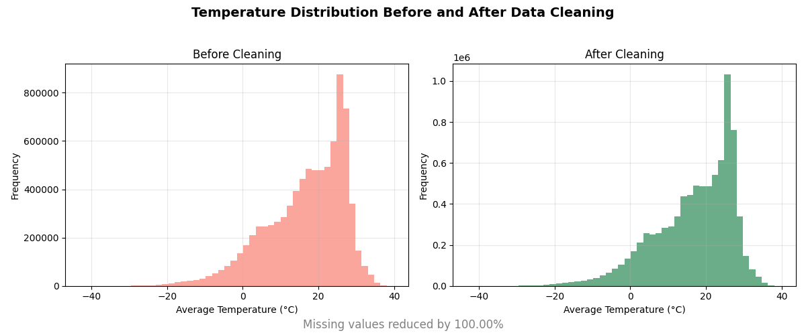

# Mini Data Cleaning Project — Global Land Temperatures

### Overview  
This project focuses on **data cleaning and preprocessing** using the *Global Land Temperatures by City* dataset.  
The dataset includes over **8.6 million rows** of temperature records from cities around the world.  
The goal was to transform this raw, noisy data into a **clean, analysis-ready dataset** — the foundation for any future AI or data-driven model.

---

### Dataset  
**Source:** [Global Land Temperatures by City — Kaggle](https://www.kaggle.com/datasets/berkeleyearth/climate-change-earth-surface-temperature-data)  
**Size:** ~500 MB (not included in this repository due to GitHub file limits).  

---

### Steps Performed  

**1. Data Exploration**  
- Loaded raw data with `pandas` and explored basic structure and statistics.  
- Checked missing values and overall dataset shape (`8.6M+ rows`).  

**2. Data Cleaning**  
- Converted `dt` column to `datetime` objects.  
- Grouped by `Country` and replaced missing values with **country-level medians** for both `AverageTemperature` and `AverageTemperatureUncertainty`.  
- Dropped residual missing values safely (ensured no significant data loss).  

**3. Validation & Analysis**  
- Compared statistical summaries before and after cleaning.  
- Verified that average temperatures and standard deviations remained stable.  
- Visualized the temperature distribution **before and after cleaning** using `matplotlib` histograms.  
- Calculated overall **missing-value reduction (%)** to measure data quality improvement.  

---

### 📈 Results  

| Metric | Before Cleaning | After Cleaning |
|---------|------------------|----------------|
| Missing Values | ~4.23% | 0% |
| Total Rows | 8,599,212 | 8,599,212 |
| Mean Temperature | ~16.8°C | ~16.9°C |

Cleaning Efficiency **100% reduction in missing values**

Data quality improved without distorting statistical properties.  
Dataset is now **ready for EDA, trend analysis, or predictive modeling.**

---

### Visualization Preview  
*(Before vs After Cleaning)*  

  
> Matplotlib visualization comparing temperature distributions before and after cleaning.

---

### Tools & Libraries  
- **Python 3.10+**  
- **pandas** — data manipulation  
- **matplotlib** — visualization  

---
